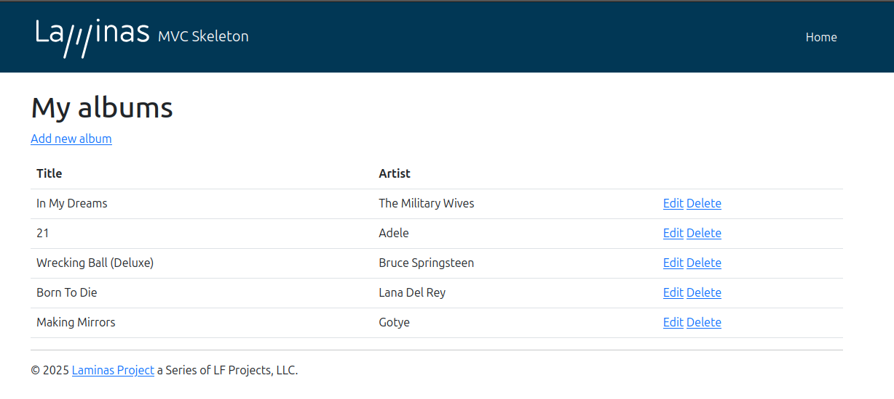

# Laminas - php



Este proyecto es una API Rest con un frontend sencillo hecho con Laminas. 

Para iniciar el proyecto, utiliza el siguiente comando:

```sh
php -S 0.0.0.0:8080 -t public public/index.php
```

Requisitos:
- PHP 8
- SQLite
- Composer